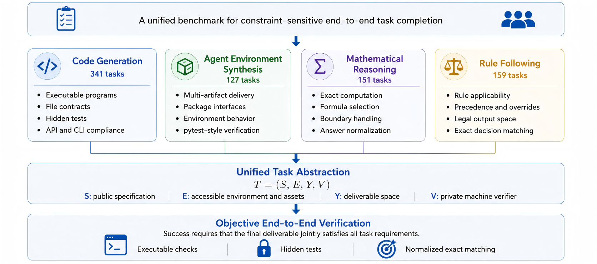
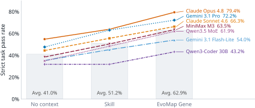
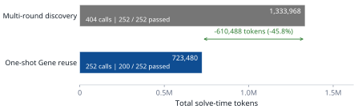
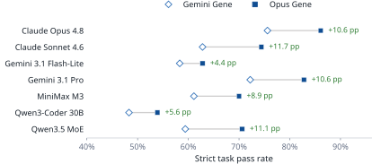
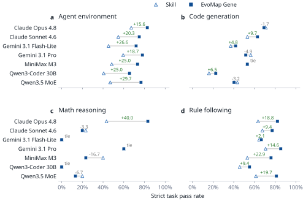

<div align="center">

# LongWoF-Bench

### 面向可验证长流程任务的 EvoMap Gene 评测基准

<p>
  <a href="https://arxiv.org/abs/2608.23200"></a>
  <a href="https://huggingface.co/datasets/EvoMapAI/LongWoF-Bench"></a>
  <a href="https://github.com/EvoMap/LongWoF-Bench-public/actions/workflows/ci.yml"></a>
  <a href="release/public_data_artifact.v1.json"></a>
  <a href="LICENSE"></a>
</p>

<p>
  <a href="#概览">概览</a> ·
  <a href="#基准契约">基准契约</a> ·
  <a href="#论文结果">论文结果</a> ·
  <a href="#快速开始">快速开始</a> ·
  <a href="README.md">English</a>
</p>

</div>

<p align="center">
  
</p>

<p align="center"><em>论文 Figure 1：778 个机器可验证任务，以统一任务抽象组织，并经客观的端到端验证把关。</em></p>

## 概览

LongWoF-Bench 用于评估大语言模型能否把长流程、高约束的工作流转化为
能够通过严格机器验证的最终交付物。当前基准包含 **778 个任务**，覆盖四类
互补的长流程形态：

- **代码生成（Code generation）**：可执行程序、文件契约、API/CLI 兼容性和隐藏功能测试。
- **智能体环境合成（Agent-environment synthesis）**：包接口、多文件交付、环境行为和 pytest 式检查。
- **数学推理（Mathematical reasoning）**：精确计算、公式选择、边界处理和规范化短答案。
- **规则遵循（Rule following）**：规则适用性、优先级与覆盖、合法输出空间和精确决策匹配。

基准评估的是最终交付物，而不是中间答案是否“看起来合理”。只有所有必要检查
都通过，任务才算成功。

## 基准契约

论文使用四元任务抽象 `T = (S, E, Y, V)`：

| 符号 | 含义 |
|---|---|
| `S` | 公开任务规范 |
| `E` | 模型可访问的环境与资源 |
| `Y` | 合法交付物的空间 |
| `V` | 任务专属的私有机器验证器 |

评测时，任务、运行时、解码配置和验证器保持不变，只改变模型获得的辅助上下文：

```text
公开规范 + 环境
      │
      ├── No Context（无上下文）
      ├── Skill       （更完整的过程性指导）
      └── EvoMap Gene（紧凑、结构化的执行经验）
      │
      ▼
模型 → 交付物 → 私有验证器 → 严格通过 / 失败
```

验证器不会额外引入模型无法获得的任务要求；完成任务所需的信息都可以从公开规范、
可访问环境、接口和输出契约中恢复。隐藏测试、参考解、金标准输出和验证器逻辑只
用于判断提交的交付物是否满足这些公开要求。

## 基准概览

| 任务轨道 | 任务数 | 典型交付物 | 验证信号 |
|---|---:|---|---|
| `code_generation` | **341** | 可运行程序、CLI、文件或 Schema | 隔离执行与隐藏测试 |
| `agent_env_synth` | **127** | 包接口与多文件交付物 | 环境支持的 pytest 式检查 |
| `math_reasoning` | **151** | 精确短答案 | 解析、规范化与精确匹配 |
| `rule_following` | **159** | 合法离散决策 | 规则优先级、答案空间检查与精确匹配 |
| **合计** | **778** |  |  |

论文中的研究证据使用四个明确命名的子集：

| 子集 | 任务数 | 在论文中的作用 |
|---|---:|---|
| 完整基准 | **778** | 衡量整体基准难度 |
| Opus-evolved | **252** | 主要的 Gene 与 Skill 对比 |
| Reference-distilled | **526** | Gene 来源分析 |
| Opus–Gemini common evolved | **180** | 同任务的 Gene 生产者对比 |

252 题子集是 Claude Opus 在演化预算内找到验证通过轨迹的任务集合，适合研究
成功经验的复用，但**不代表全部 778 题**。

## 论文结果

主要对比在 252 个 Opus-evolved 任务上进行。七个消费模型的严格通过率平均值从
**41.0%（No Context）**提升到 **51.2%（Skill）**，再提升到
**62.9%（EvoMap Gene）**。Gene 在全部受测模型上都优于 Skill，提升幅度为
**8.7–15.5 个百分点**；对 Claude Opus 4.8，提升为 **63.9% → 79.4%**。

作为具有代表性的完整基准，778 题上的最佳无上下文结果也只有
**20.2%（157/778）**。完整集合的 Opus Gene 列混合了 252 个 evolved、525 个
reference-distilled 和 1 个 skill-distilled Gene，因此它描述的是已发布资产集合，
不能当作 Gene 构造方式的干净消融实验。

<p align="center">
  
  
</p>
<p align="center"><sub>左：Figure 3；右：Figure 5。两张图均为论文原图。</sub></p>

在相同的 252 个任务上，单次 Opus + Gene 复用通过 **200** 题、消耗
**723,480** 个 solve-time tokens；Skill 通过 **161** 题、消耗 **803,099**
个 tokens。也就是说，Gene 多通过 **39** 题，同时将 solve-time token 总量
降低 **9.9%**。相对于产生这些验证轨迹的多轮探索，一次 Gene 复用将调用数从
404 次降到 252 次，token 总量降低 **45.8%**；该比较不包含一次性的 Gene
蒸馏成本。

<details>
<summary>更多论文分析（Figure 4 和 Figure 6）</summary>

<p align="center">
  
  
</p>
<p align="center"><sub>左：180 个共同演化任务上的 Gene 生产者对比；右：四类工作流的增益拆分。</sub></p>

在互补的 526 个 reference-distilled 任务上，Gene 对全部七个模型都落后于 Skill，
差异为 **3.0–11.2 个百分点**。因此，完整 778 题结果和演化 252 题结果回答的
研究问题不同，应该分开报告。

</details>

仓库中的脱敏证据包包含论文使用的逐任务指标、表格、置信区间、配对检验和 token
统计。指标范围与限制见 [`results/README.md`](results/README.md)；也可以直接查看
[完整 778 题表格](results/tables/full778.md)、[演化 252 题表格](results/tables/evolved252.md)、
[配对检验](results/tables/statistical_tests.md)和[token 统计](results/tables/token_efficiency.md)。

## Gene 的构造与复用

LongWoF-Bench 将成功执行视为可复用经验：

1. 生产模型在无法看到私有验证器的情况下尝试完成任务。
2. 失败尝试会获得经过清洗的验证反馈，并在固定 rollout 预算内继续修正。
3. 找到验证通过轨迹后，将其中关键的执行策略、修正、前置条件、边界条件和失败
   防护蒸馏为结构化的 **GDIv2 Gene**。
4. 消费模型只获得公开任务和 Gene，不会看到生产轨迹或验证反馈。

这种方式把“发现成功策略”的成本与“复用已验证经验”的成本分开，并支持跨模型
家族迁移执行经验。

上述流程由 [`eval/evolve_genes_v3.py`](eval/evolve_genes_v3.py) 实现。作为对照的
Skill 基线由 [`eval/generate_agent_skills_v3.py`](eval/generate_agent_skills_v3.py)
生成、并由 [`eval/rewrite_skills_v3.py`](eval/rewrite_skills_v3.py) 做泄漏审计改写，
因此对比的两侧都可以从本仓库复现。

## 公开发布边界

本仓库是 **v1.0.2 公开代码与研究证据发布版**。官方任务规范、运行时输入以及
最终测试版 Skill/Gene 上下文会以独立的公开数据包形式发布，元数据见
[`release/public_data_artifact.v1.json`](release/public_data_artifact.v1.json)。仓库
本身包含合成任务、Skill 与 Gene 的代码，但不包含这些代码产出的材料：不会包含
私有验证器、隐藏测试、金标准输出、参考解、原始轨迹或作者任务树。运行
[`synth/`](synth/) 会在本地重新生成这些材料，它们不会被发布。

发布边界已完成审计，并绑定到 release ID `ad87fa3c374e7098d712d7a6`。排除受限
Skill 目录后，公开数据包包含 4,412 条审计记录；代码/数据拆分、校验和与
Sigstore 元数据见
[`release/asset_policy.v1.json`](release/asset_policy.v1.json)、
[`release/stage_c_release.v1.json`](release/stage_c_release.v1.json)和上述发布记录。

其中 12 个 SkillsBench 衍生任务（`T0464`、`T0465`、`T0466`、`T0467`、`T0469`、
`T0471`、`T0473`、`T0482`、`T0483`、`T0484`、`T0485`、`T0486`）包含在获得相关
权利人许可前不能公开分发的嵌套 Skill 包。公开仓库只保留稳定的任务编号和来源
映射，不提供这些包的下载器、镜像、归档地址、凭证或自动安装器。任务级边界以及
只读本地存在性检查见 [`THIRD_PARTY_NOTICES.md`](THIRD_PARTY_NOTICES.md) 和
[`受限 Skill 指南`](docs/RESTRICTED_SKILLS.md)。

任务 `T0498` 另外打包了 Amazon、Meta 与 Google 的商品类目体系，均未能确认再分发
许可。自 v1.0.2 起，它们通过同一机制从归档中排除；该任务自带的数据 README 予以
保留，便于自行从权利人处获得这些数据的用户知道放置位置。参见
[`release/restricted_assets.v1.json`](release/restricted_assets.v1.json)。

## 快速开始

代码仓库本身有意不包含完整任务池。请从 `v1.0.2` GitHub Release 下载公开数据包，
校验并解压，然后从中重建创作布局：

```bash
BASE=https://github.com/EvoMap/LongWoF-Bench-public/releases/download/v1.0.2
ARCHIVE=taskgenome-bench-public-data-v1.0.2.tar.gz

curl --fail --location --remote-name "$BASE/$ARCHIVE"
curl --fail --location --remote-name "$BASE/$ARCHIVE.sha256"
sha256sum --check "$ARCHIVE.sha256"
tar -xzf "$ARCHIVE"          # 解出 taskgenome-bench-public-data-v1.0.2/
```

数据包同时带有签名。签名身份是本仓库的发布工作流而非某个人，因此验签时应同时
固定身份与签发者：

```bash
curl --fail --location --remote-name "$BASE/$ARCHIVE.sigstore.json"
cosign verify-blob --bundle "$ARCHIVE.sigstore.json" \
  --certificate-oidc-issuer https://token.actions.githubusercontent.com \
  --certificate-identity-regexp \
  '^https://github\.com/EvoMap/LongWoF-Bench-public/\.github/workflows/sign-release\.yml@' \
  "$ARCHIVE"
```

数据包解压后是分发布局 —— `data/tasks`、`data/contexts`、`data/runtime`、
`data/environments`；而评测入口消费的是创作布局，即每个任务的全部资产集中在
`scenarios/<task_id>/` 下。首次运行前先重建这个布局。这一步不做任何推测：
`data/release.json` 为每个资产同时记录了两种路径，复制时逐个文件重新校验其
SHA-256。

```bash
git clone https://github.com/EvoMap/LongWoF-Bench-public.git
cd LongWoF-Bench-public
pip install -r requirements.txt

python tools/materialize_public_pool.py \
  --bundle-root /path/to/taskgenome-bench-public-data-v1.0.2 \
  --out tasks_final
```

它会写出 `tasks_final/manifest.json`、`tasks_final/scenarios/<task_id>/` 以及两套
Gene 集合，并报告 `"task_count": 778`、`"assets_copied": 4412`。随后把评测入口指向它：

```bash
# 先确认公开评测入口存在并查看参数。
python -m eval.run_official --help

python -m eval.run_official \
  --manifest tasks_final/manifest.json \
  --pool-root tasks_final \
  --protocol legacy-v1 \
  --ids T0499 \
  --models gemini_flash \
  --conditions no_context,with_skill,with_gene_opus \
  --gene-opus-dir tasks_final/genes_opus48 \
  --dry-run \
  --run-id readme-quickstart
```

dry-run 不会调用模型服务商，也不会执行候选代码；正常情况下会显示加载 778 个任务，
并为 `T0499` 创建 3 个待执行 trial。移除 `--dry-run` 会改变安全与凭据要求，请先
阅读 [`SECURITY.md`](SECURITY.md)。`legacy-v1` 保留历史主机执行行为，只适合可信且
可丢弃的机器；新的不可信候选代码应使用摘要固定的 `hardened-v2`，但该路径目前只
支持安全策略中列出的任务子集。

## 复现论文证据

从仓库内的脱敏指标离线生成公开 Markdown/LaTeX 表格、聚合 CSV、统计检验和结果图：

```bash
python -B tools/research_results.py render
```

该命令不会调用模型、执行候选代码或访问私有判题器。冻结协议和子集规则记录在
[`docs/RESEARCH_V1.md`](docs/RESEARCH_V1.md)和
[`docs/REPRODUCIBILITY.md`](docs/REPRODUCIBILITY.md)。

## 仓库导航

| 路径 | 内容 |
|---|---|
| [`eval/run_official.py`](eval/run_official.py) | 官方评测入口 |
| [`tools/materialize_public_pool.py`](tools/materialize_public_pool.py) | 从公开数据包重建创作布局 |
| [`tools/public_data_smoke.py`](tools/public_data_smoke.py) | 对解压后的数据包做免凭证 dry-run 自检 |
| [`eval/evolve_genes_v3.py`](eval/evolve_genes_v3.py) | GDIv2 Gene 进化器：rollout、验证反馈、蒸馏 |
| [`eval/generate_agent_skills_v3.py`](eval/generate_agent_skills_v3.py) | Skill 基线的 Agent Skill 生成器 |
| [`eval/rewrite_skills_v3.py`](eval/rewrite_skills_v3.py) | 带泄漏审计的 Skill 改写器 |
| [`synth/`](synth/) | 任务合成流水线：seeds、authoring prompts、难度标定、合池 |
| [`results/`](results/) | 脱敏指标、表格、检验和生成图片 |
| [`release/public_data_artifact.v1.json`](release/public_data_artifact.v1.json) | 公开数据包元数据和 release ID |
| [`release/asset_policy.v1.json`](release/asset_policy.v1.json) | 公开/私有资产分类策略 |
| [`release/stage_c_release.v1.json`](release/stage_c_release.v1.json) | Stage C 发布记录 |
| [`docs/assets/paper/`](docs/assets/paper/) | 从 arXiv v2 同步的 README 配图 |
| [`examples/dev_task/`](examples/dev_task/) | 带公开判题器的开发任务示例 |
| [`SECURITY.md`](SECURITY.md) | 执行与发布安全说明 |
| [`LICENSE`](LICENSE) | 公开代码的 Apache License 2.0 |
| [`DATA_LICENSE.md`](DATA_LICENSE.md) | 独立公开数据包的 CC BY 4.0 条款 |

公开数据包解压并重建后，得到的 `tasks_final/` 目录会提供评测所需的任务规范和最终
测试版指导资产；私有评测包不属于公开发布范围。

## 引用

如果使用 LongWoF-Bench，请引用论文和本仓库：

```bibtex
@misc{zhang2026longwofbenchevaluatingevomapgenes,
  title         = {LongWoF-Bench: Evaluating EvoMap Genes for Verifiable Long-Workflow Tasks},
  author        = {Zhang, Xiao and Sun, Qumeng and Li, Jiahao and Ren, Yiming
                   and Liu, Xiang and Zhang, Haoyang and Wang, Junjie},
  year          = {2026},
  eprint        = {2608.23200},
  archivePrefix = {arXiv},
  primaryClass  = {cs.CL},
  url           = {https://arxiv.org/abs/2608.23200}
}
```

机器可读引用也见 [`CITATION.cff`](CITATION.cff)。

## 许可

本仓库中的公开代码采用 [Apache License 2.0](LICENSE)。单独分发的公开数据包采用
[CC BY 4.0](DATA_LICENSE.md)；该数据许可仅适用于明确包含在数据包中的资产。私有
评测资产不在分发范围内；如某些文件存在第三方声明，以相应声明为准。

<div align="center">
  <sub>LongWoF-Bench · Infinite Evolution Lab, EvoMap · 清华大学</sub>
</div>
